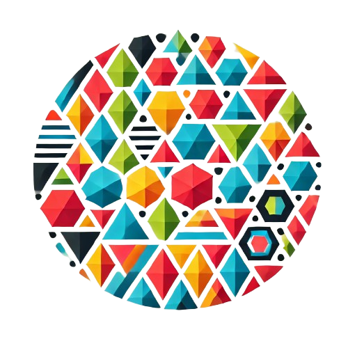

#  Python Bindings for PolyDiM&GeDiM 

**PolyDiM** (POLYtopal DIscretization Methods ) is a numerical computational library designed for solving partial differential equations (PDEs) using discretization methods that operate on generic polytopal (polygonal/polyhedral) meshes.

PolyDiM is inspired by and built upon the foundational research of the Numerical Analysis Group in the Department of Mathematical Sciences "Giuseppe Luigi Lagrange" (DISMA) at the Politecnico di Torino.

See the official [documentation](https://polydim.it/).

This file can be used by citing references in CITATION.cff file in the GitHub repository.
